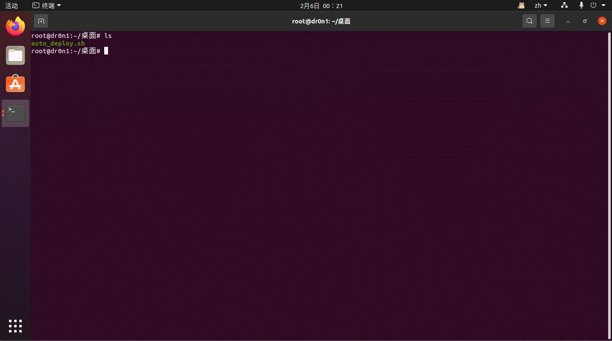

# CTF_misc_auto_deploy

一个自动安装 CTF Misc/Pwn/Web 常用工具的~~轻量~~sh 脚本  
适合在新虚拟机中快速安装工具

# 目前支持的功能

1：基础功能（换网络源，允许 root ssh 登录等）  
2：安装 docker  
3：安装 docker-compose  
4：安装 golang  
5：安装 java  
6：安装 linux 下的部分 pwn 工具  
7：安装 linux 下的部分 misc 工具和第三方脚本  
8：安装 linux 下的部分 web 工具

具体如下

```text
misc:
binwalk
bkcrack
blindwatermark
cloacked-pixel
dtmf2num
dwarf2json
exif
extundelete
f5-steganography
foremost
gaps
gnuplot
identify
minimodem
montage
outguess
pycdc
sstv
steghide
stegosaurus
stegpy
stegseek
usb-mouse-pcap-visualizer
usbkeyboarddatahacker
volatility2
volatility3
webp
wireshark
zsteg

pwn:
pwntools
ropper
one_gadget
pwndbg
gef
seccomp-tools
qemu

web:
reverse-shell-generator(docker)
neo-regorg(tunnel)
stowaway(tunnel)
frp(tunnel)
```

# 支持的系统

已在 ubuntu 20.04.6/22.04.5/24.04.2 中完成测试

部分功能需要配合代理使用

# 使用

本脚本可重复运行安装  
工具保存在运行脚本的`misc_tools`,`pwn_tools`和`web_tools`目录下

方法一：  
git clone https://github.com/dr0n1/CTF_misc_auto_deploy  
chmod +x auto_deploy.sh  
./auto_deploy.sh [mode]

```shell
usage: ./auto_deploy.sh [mode]
                base                            基础配置
                docker                          安装docker
                docker-compose                  安装docker-compose
                go                              安装golang
                java                            安装java
                misctools                       安装misc工具
                pwntools                        安装pwn工具
                webtools                        安装web工具

示例: ./auto_deploy.sh base docker
```

方法二：  
bash <(curl -s https://raw.githubusercontent.com/dr0n1/CTF_misc_auto_deploy/main/auto_deploy.sh) [mode]



# 更新日志

V1.0: 第一代脚本  
V1.1: 增加 python 安装模块  
V1.2: 优化安装逻辑等  
V1.3: 移除 python，新增 golang 和 java  
V2.1: 增加 CTF-Misc 部分工具的安装  
V2.2: 优化可重复运行脚本逻辑  
V2.3: 优化部分 python 模块安装逻辑  
V2.4: 增加部分 misc 工具，格式化代码  
V3.1: 移除了 centos 的工具支持，增加 golang 多版本支持等  
V3.2: 修复了诺干 bug，增加了 java 版本管理  
V4.1: 添加 pwntools 等工具  
V4.2: 添加了部分 web 工具

---

本项目仅用作学习教育目的, 不用于任何其他用途, 如有侵权请第一时间联系作者删除

This project is only for learning and educational purposes and is not intended for any other purpose. If there is any infringement, please contact the author immediately to delete it
